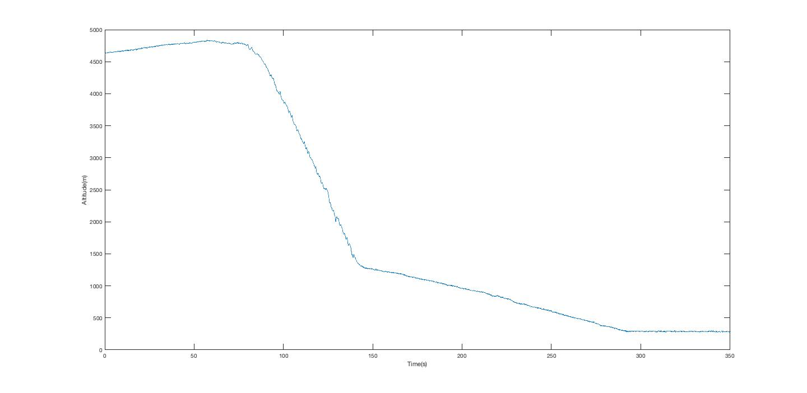
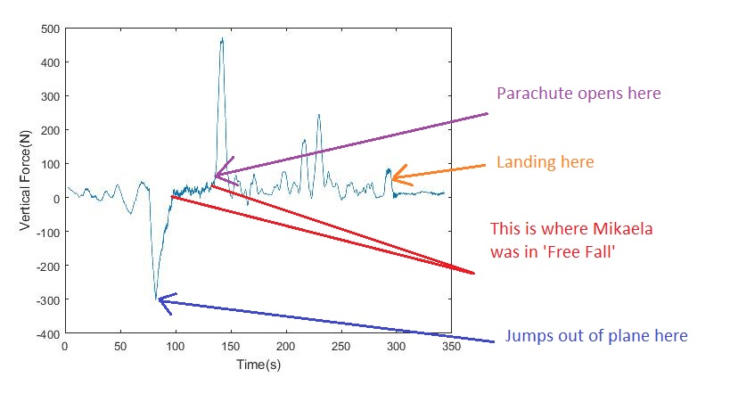
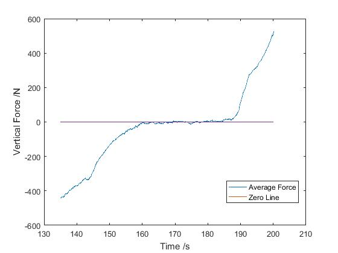
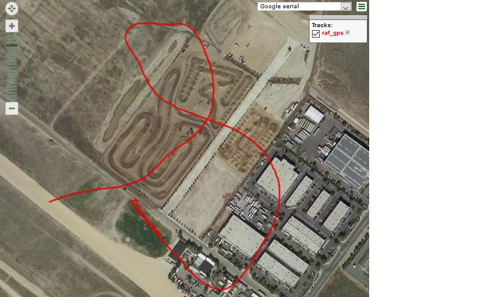
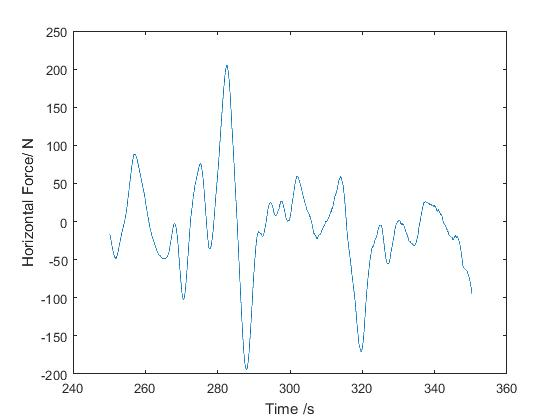
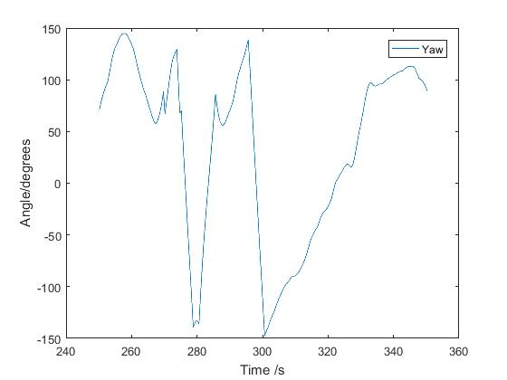
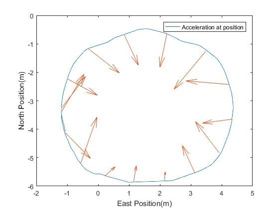

# RAF

|                     |       | 
:--------------------------------------:   |   :------------------------:

# Introducing Vertigo 
### an Institute for Research in Schools project supported by the ERAF

The application of Newton’s I and II laws to moving objects is often a challenging and fun learning journey for school pupils in KS3 and KS4.  But it is invariably a theoretical exercise.  Diagrams, videos and simulations can all support concept acquisition but, data to analyse, in this topic at least, is difficult to come by.

                             |                     |  
:------------------------------------------:|:--------------------------:|:-------------------------------------------:
             

IRIS’s 'Project Vertigo' offers students just that opportunity.  What's more, to celebrate the RAF's 100 year aniversary, Flt Lt Mikaela Harrison kindly agreed to take vertigo on one of her training jumps. below is a short analysis of the data she recorded for the project and an insight into the type of learning this can support within schools.

|                     |       | 
:--------------------------------------:   |   :------------------------:

Project Vertigo is a collaborative effort made possible through IRIS and the ERAF foundation.  Designed by Dr Jon Sowman (Project Engineer for Fraser Nash) this neat little device offers hi-fidelity position and orientation data logging.
Jon describes, “Developing the firmware that allows Vertigo to output accelerations in a Earth-based reference framce was a real challenge.  But I am delighted that those efforts are now available to schools through IRIS and that the device is being used in so many exciting new contexts.”

This "*Earth-based reference*" frame functionality makes for perfect analysis of a skydiver’s key metrics.  Throughout the jump, as their orientation varies, Vertigo will keep track of the parachutist's rotations and return accelerations in a world frame.  Put simply, no matter how Vertigo is held or moved, it will always resolve the skydiver’s downward acceleration.

This leads to some very interesting results.  And results that are real – not the slightly sterile book version of what happens in a ‘Jump’.

Here is a graph that pupils will have few problems reconciling with their current understanding.

 

With the gradient being equal to velocity, it is quite clear to see when the skydiver jumped out of the plane and when she opened her parachute.  An exercise here could be to measure the gradients and find a true value for a person’s terminal velocity.

In this example, terminal velocity works out to be m/s whilst in freefall and  m/s once the parachute is deployed.

Comparing this graph to the vertical forces experienced is fascinating.
The graph below shows resultant force – ie. whilst contact forces and weight are in equilibrium, a zero downward force is displayed.

 

The first thing to notice is just how much noise there is.  Not something pupils are familiar with, but something they’ll need to get used to as they move further into ‘real science’.

And within that noise is some brilliant data.

A special point of interest, is to see the magnitude of the force when the Parachute is first opened.  It doesn’t last too long, but comes on pretty quickly.  It must feel like quite a jolt.
The other area which certainly warrants further investigation, is the section between 105 and 140 s.  This is when air resistance and drag are in equilibrium.  The graph is anything but smooth, however.  And why would it be?  Here we have a human, being buffeted around as she moves and adjusts her position within the Falcons Team.  Staying perfectly still must be all but impossible.  The textbooks really are presenting a particularly smoothed outlook on reality!

Here’s the same section with a moving average to help 'iron-out' the variation in force.

   

It would be intriguing to investigate how this force varies as the sky-divers orientation changes.  Presumably, this will follow the area of the body presented to the down direction, which may be a function of orientation.

A second point of interest are the two peaks in downward force at 220s and 230s respectively.

Landing occurs at 290s.  We can see that from both the height and force data.  So what is happening at 220 and 230 seconds?

Clues can be gathered here from a gps plot, Horizontal Force and orientation data.

     

               |          | 
:--------------------------------------:|:------------------------:| 
 Horizontal Force                       |  Yaw Angle              

Whilst approaching the landing zone, the Sky-diver makes several turns to help reach the correct place at the desired speed and angle.

The mechanics of a parachute mean that the centripetal force for these turns acts towards the parachute itself.  And a component of this force acts directly upward, another horizontally.  Somewhat surprisingly, these forces are quite large.  For someone who has never jumped out of a plane, this data was unexpected, although not unexplainable.

This has always been one of the pleasures when working with Vertigo data.  What at first glance looks odd, is often very explainable, and challenges pupils' misconceptions of what really does go on in real life.

And the scope for analysis is huge.

Pupils around the country are investigating a massive range of moving objects.  Whether it’s a Green-Power car, tube train accelerations, hurricanes or oceanography 

Here is a graph showing the acceleration of a one-person electric car driving in a circle.  Notice again how the data is not exactly as one would see it in a GCSE or A-level textbook.  Motion in a circle is nearly always reviewed considering a constant speed.  But that’s not always how things work.  The car, for example, is travelling on a slight slope and so gets slightly faster and slower on its journey.  Hence not all accelerations are completely tangential to the velocity.   

 
   

Schools wanting to get involved are in for even more of a treat too.  Vertigo has been enhanced, making data analysis easier, more intuitive and in real-time.

       |        | 
:--------------------------------------:|:------------------------:| 
Vertigo unit                 |           New Web based analysis       

The new website – launch at IRIS’s second birthday celebration at the Crick institute, can take data from the new Vertigo units directly through its Bluetooth connection, and plot data immediately.

  

