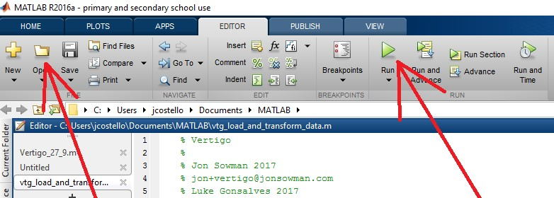
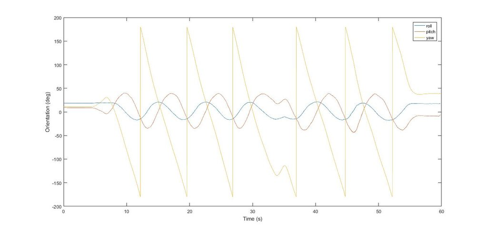
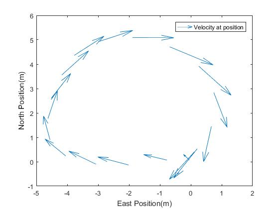
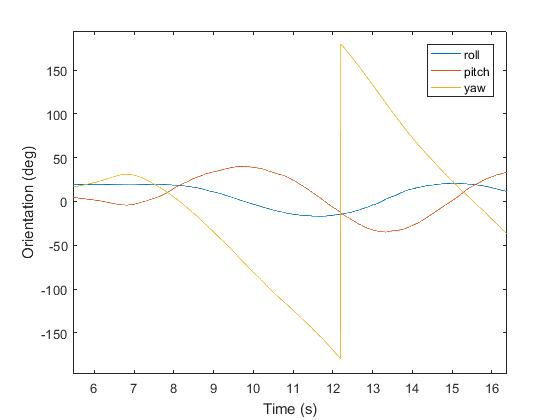
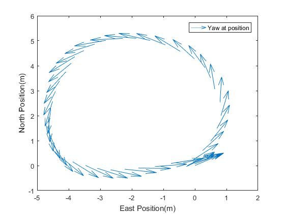

# VertigoIMU: Data analysis with Matlab   
 

 
 [Home](index.md)
 
 
 
Contents:

* [Setting up your computer](#setup)
* [Importing data](#load_data)
* [Modifying matlab scripts](#scripts)
* [Common problems](#problems)

## Setting up your computer

You will first need to download and install Matlab from [Mathworks](http://uk.mathworks.com/):

Once this is complete:

1)	Create a folder in your computer.  Call it Matlab_files.
2)	Copy [these](Link_files.zip) files into your new folder.
3)	Open Matlab the programme.

## Importing data.

1)	Data will have been stored on Vertigo's mico SD card.  Slot this into your SD card reader and insert this into your laptop or computer.  If you do not have an SD card slot, USB SD card readers are readily available.

2)	In the top right corner of matlab’s home page click ‘open’ and navigate to the matlabfiles folder you created earlier.  Open the programme: vtg_load_data_and_transform.  Click the green arrow to run.

3)	Whilst executing, the script will ask you to open a data file.  If you have taken some data yourself open it now. (It will have a name vtg_log**). If not, open the demo file called Car_in_a_circle_demo.csv
4)	You will see a graph which looks like this.

5)	Notice the active times which you are interested in.  In the example above, the time period from 7- 15 seconds shows the car completing one full circle.

## Modifying matlab scripts.

The matlab scripts can be modified by the user.  Please note, any changes made in the editor will automatically update the saved file.  It may be useful to save the file under a different name.  The original versions will always be available here.

SGS Greenpower car                  |  Car position measured by Vertigo
:-------------------------:|:-------------------------:
    |  

### Position, velocity and acceleration.

The following script plots Vertigo's position, velocity and acceleration as points then as vector arrows.  (This is called a quiver plot)

Velocity quiver plot                   |  Acceleration qiver plot
:-------------------------------------:|:-----------------------------------:
                |  

### To plot these:

1)	load kalman_filter_graphs.m.

2)	Click run

3)	You will be asked in the command window "What time do you wish to start analysis from?"  Type your answer, in seconds, in the command window.
You will then be asked "What time do you wish to end the analysis?" Type your answer, in seconds, in the command window.
  
In the demo, the start and end times are 7 seconds and 15 seconds respectively.  Use the very first graph from Vtg_load_data_and_transform to help you decide on the time window to observe.  If your time window exceeds the measured data matlab will respond with a ‘ping’ and the message: 

### Index exceeds matrix dimensions

4)	Alter the time window values and click run.

### Position, pitch, roll and yaw.

The following script plots Vertigo's position, pitch, roll and yaw.  These are rotations around the East, North and Down axes respectively.  
A person walking clockwise on a flat piece of ground will complete 360 degrees of yaw for every full circle they walk.  The person is rotating around an imaginary axis that points into the ground.  If the walker completed 10 complete revolutions they would have traversed 3600 degrees yaw!  For this reason, pitch, roll and yaw angles are plotted between a maximum of 180 degree and a minimum of -180 degrees.  181 degrees then becomes -179 degrees.  
The graphs for pitch, roll and yaw can look rather confusing at first sight.  Normally, unless Vertigo does a vertical 'loop the loop' the pitch and roll will always be within the +/-180 degrees axes.  Yaw often exceeds these values.

Pitch, roll, yaw against time       |  Yaw at positions North/ East
:-------------------------:|:-------------------------:
    |  
