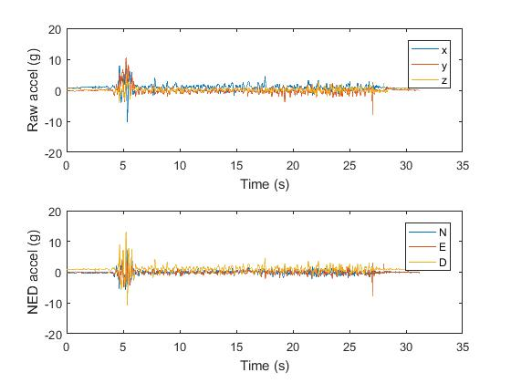
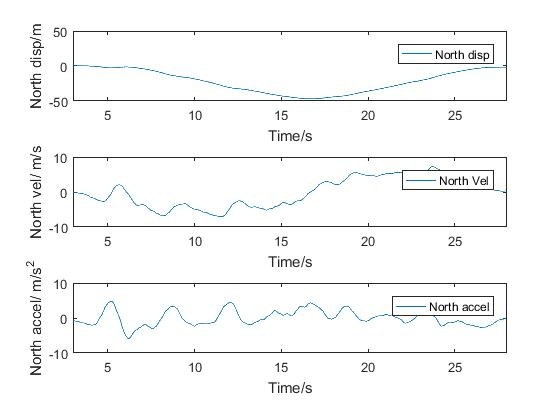
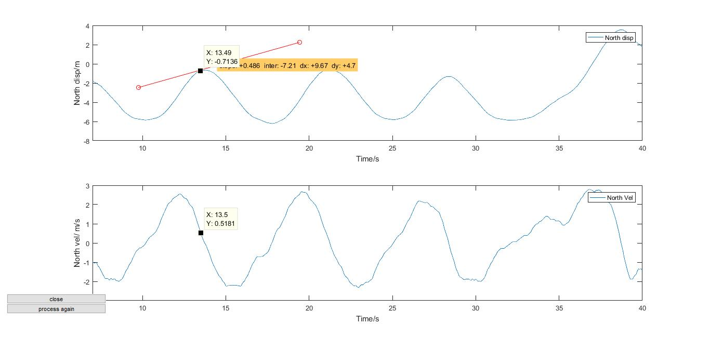
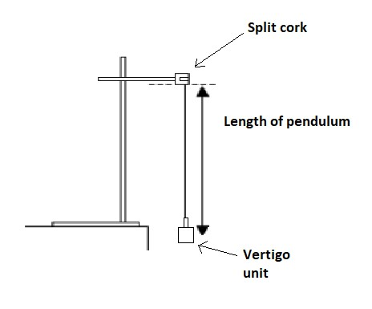
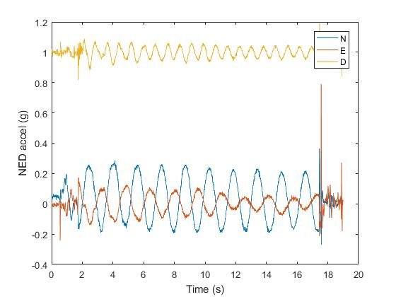
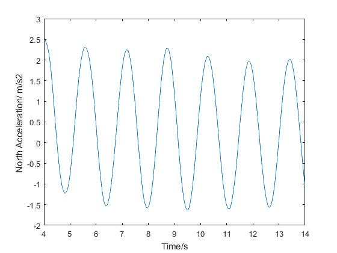
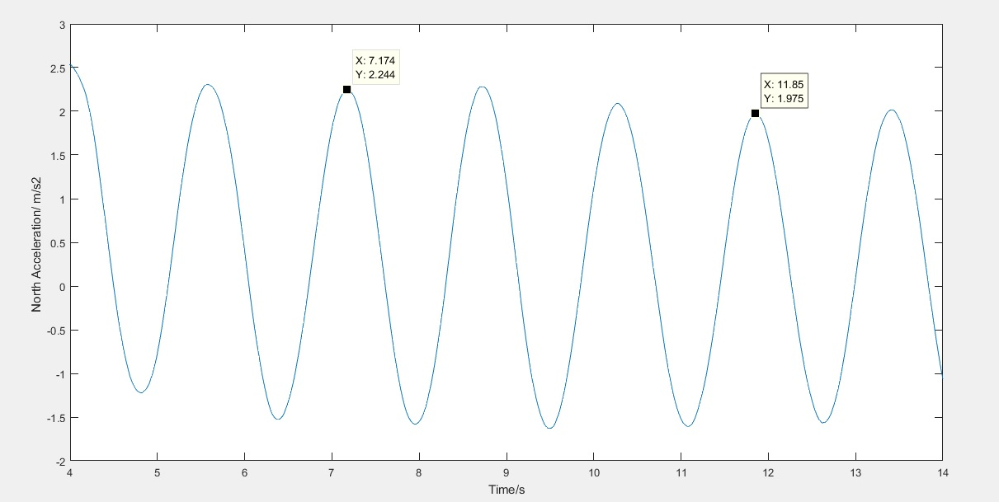
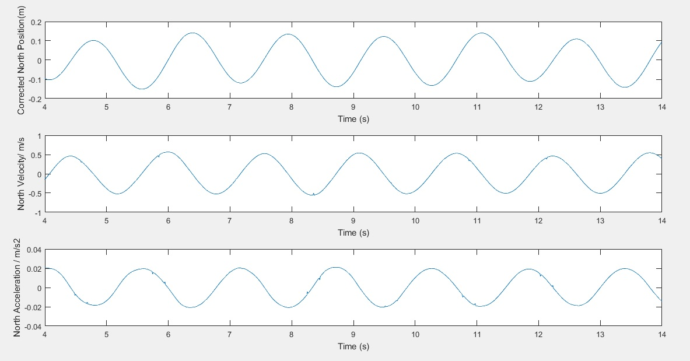
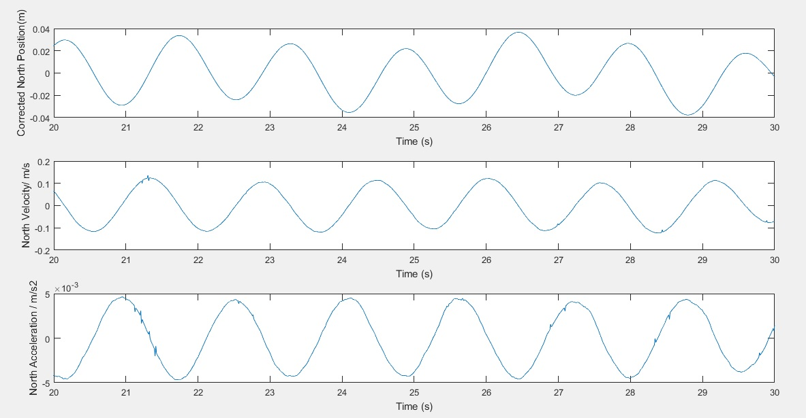
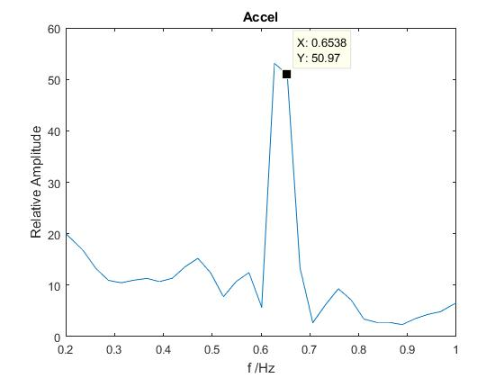

# Lessons Available

[Physics of Springting](#sprint)

* [Beginner](#BeginnerS)
* [Intermediate](#IntermediateS)
* [Advanced](#AdvancedS)

[Investigating Pendulums](#Pendulums)

* [Beginner](#BeginnerP)
* [Intermediate](#IntermediateP)
* [Advanced](#AdvancedP)

## Physics of Sprinting

# Investigating the displacement / time graph for a sprinting pupil.

#### The aim of this lesson is to give pupils the chance to investigate an accurate displacement / time graph generated by one of the students in the class.

# Curriculum links
### KS3 Physics National Curriculum
•	speed and the quantitative relationship between average speed, distance and time (speed = distance ÷ time) 

•	the representation of a journey on a distance-time graph

### KS4 Physics National Curriculum
•	interpreting quantitatively graphs of distance, time, and speed 
•	acceleration caused by forces; Newton’s First Law

# Planning
This activity requires the software package matlab.  Please ensure your pupils have access to this programme and the relevant scripts highlighted below.
It is advisable that teachers familiarise themselves with the process before delivering the lesson content to a class.

# Safety 
Hazzard	
* Playground surface                    

Risk	
* Slip / fall / injury   

Control
* Assess surface conditions before the lesson
* Cancel if the ground is too slippery
* Ask pupil to take extra care when running

# Starter activity
The [Physics_of_Sprinting](The_Physics_of_Sprinting.docx) worksheet

## Beginner

# Data acquisition

* Making sure the Vertigo unit is fully charged, take the class to a suitable outdoor area to record your data.
* Turn the unit on and wait for the second LED to stop flashing.  This means that Vertigo has a GPS signal.  It may take a                    minute.
* Select a pupil to run with Vertigo.  
* Request that the pupil carries the device like an athlete carrying the
  Olympic torch.  (This is not strictly necessary but, with more wobbling around, 
  Vertigo may miss a GPS point.  This would make analysis far trickier
  – and is not conducive to good lesson outcomes).
  
  
  
*	Press the Log button (a solid LED light come on) and set the pupil off on a pre-determined route.

On their return, press Vertigo’s log button again.  The solid LED light starts to flash.  When it stops flashing, Vertigo may be turned off; the data is ready to be analysed.

# Data analysis

The following files should be emailed (or otherwise given to the pupils) before the lesson.  (Show my homework or similar may be of help here)  The files need to be used by the pupils from a directory of their own.  Else, any modifications the pupils might make would be apparent to all.

These can all be found [here](Ks3_Lesson_link.zip)

Ask the pupils to download them to a non-shared drive.

Ask the pupils to open matlab and, using the top left icon, open the file “Load_up_your data”
In the meantime, the csv file created will need to be accessed by the pupils.  This should be added to a public drive or emailed to the pupils.

Pupils should execute this script by using the run button, top centre of the screen.  They will be prompted to open a file.  This file should be the one recorded in the lesson.
After a short time, a graph similar to the one below, should appear:  

In the graphs above, it can be noted, that the pupil started to run at 3 seconds and stopped at about 28 seconds.

This information is important.

In the command window, located at the bottom of the screen, pupils will be asked, 
“What time do you wish to start analysis from?”
Pupils should enter a time in this window and hit the enter key.  For the example above, they might add 3, and press enter.
They will then be asked, 
“What time do you wish to end the analysis?”

28 seconds would be a reasonable time to end.

The programme will then perform its analysis.  This may take a moment.

Eventually, matlab will produce a graph similar to the one below:

 

On the ‘figure’ screen, under the desktop ‘tab’ is the data-cursor icon.

 

Pupils can click this to add a cursor point the graph’s curve.  This will give them ‘x and y’ coordinates.  In this case, Time and Displacement or Velocity.
Multiple cursor points can be added by holding shift and re-clicking.

The shape of the graphs can be discussed with the pupils.  They can then answer the questions on the reverse of ‘The Physics of sprinting’.

## Intermediate

Go back to the file and to lines 399 to 411.
These have been commented out but can be revived by clicking the green %x symbol at the top of the screen.  Some lines will remain green – this is intentional.
 

Running the script again will give the pupils a quiver plot of the pupil’s velocity through time.  See if the pupils can work out what they’re looking at and ask them to label the axes.

This is an excellent time to initiate a discussion on vectors.

## Advanced

# Gradients

Closing the most recent quiver plot students should open the file:
 
Getslopeintercept.m

This will open the most recent figure and ask the user to click on the graph.  The pupils will be able to draw a tangent to the displacement/ time curve.
The programme will then generate a value for the gradient.
Using cursors as before, the pupils will be able to verify that the gradient of the distance time graph is the velocity at that instant.  (This is useful as it highlights positive and negative gradients).
 

 
 
It is also possible, by de-commenting lines 386 – 390, to view the acceleration against/ time.
  

## More pupils
 
It is likely that pupils will want to compare their V/t graphs...  Welcome to the Vertigo project!
 

## Pendulums

# Investigating the periodic motion of a pendulum

### Curriculum links

Key Stage 4 National Curriculum

•	interpreting quantitatively graphs of distance, time, and speed 
•	acceleration caused by forces; Newton’s First Law 
•	 amplitude, frequency

### Safety

Normal safe practice should be followed whilst in the laboratory.  

### Introduction

There are many ways to analyse the motion of a pendulum.
This activity offers three different approaches of increasing complexity.

The beginner section looks at the acceleration Vertigo has experienced and offers a very simple determination of the Time period of oscillations.

The intermediate activity gives scope for pupils to investigate the relationship between displacement, velocity and acceleration.

The advanced analysis converts the data from a time domain into the frequency domain, introducing students to the Fourier transform and a means of presenting data they will likely not have encountered before.

# Beginner

This analysis could fit into a wider study, perhaps investigating the relationship between pendulum length and Time period.
It could also be used as a means of comparing data gathered by hand and by data loggers.  The latter, ought to, in this case, yield a more accurate answer with smaller uncertainties.

### Set-up

*Tie Vertigo to a 1 metre length of light inextensible string (cotton thread would be best).  
Although the GPS antenna will not be needed for this investigation, it does provide a convenient point to attach the string to, and so could still be connected to the vertigo board.

*Using two small pieces of wood, or a split cork, fix the other end of the string into a clamp.  The clamp can then be connected to a retort stand as shown below.

The length of the string is not too important but should be between 20cm and 1 metre.  Measurng the length of the string should be from the bottom of the split cork to the centre of mass of the vertigo unit.  This will involve some uncertainty.  It may be useful to have pupils estimate this uncertainty and quote it in their results.

### Data capture

*Turn the vertigo device on

*Wait for 30 seconds, keeping vertigo reasonably stationary

*Press the log button to start logging

*Displace vertigo to an angle of approximately 30 degrees and release

*Allow Vertigo to perform 10 full swings

*Stop the device and press the log button again.

### Analysis

*Remove the sd card from Vertigo and place it into a suitable sd card reader.

*Open the programme matlab

*The following files must be downloaded into a single folder [Pendulum_scripts](Pendulum_scripts.zip)

*In matlab, click the 'open' icon located in the top left of the screen, and navigate to the folder that has been downloaded.  Open the file Pendulum_lesson.m

*Click run

A graph will quickly appear that resembles the graph below:

In the command window, the operator will be asked

“Which orientation looks best? - North (1) or East (2)”

In the graph above the Blue line shows the clearest trend.  This depends on which way the pendulum has been orientated. There will be a choice of either North or East as the pendulum has most amplitude in these directions.

Please enter, into the command window, a ‘1’ for North or a ‘2’ for East

The user will then be asked 
“when would you like to start the analysis?”
Followed by:

“when would you like to end the analysis?”

Looking at the graph, it is clear that the less noisy oscillations occur beyond 4 seconds and end at around 16 seconds.
Enter these values when prompted.

A new graph will then appear.

 

This graph can be used to determine the time-period of the pendulum.

For very accurate readings, the cursor icon 

 
will allow pupils to find x/y values within 2 decimal places.

The time period for the pendulum above is 

 

11.85s – 7.17s = 4.68 seconds for 3 full oscillations

Time Period = 4.68seconds/ 3    = 1.56 seconds

Giving a frequency of 0.64 Hz

This corresponds to a length of 60cm -which was exactly the length used.

# Intermediate

In addition to investigating the Time period of the pendulum, its movement in the North and or East directions can be analysed.

The following script can be used to produce a graph of displacement, Velocity and acceleration.  

The script contains similar prompts as in the beginner exercise.

As before, in matlab open the file Pendulum_lesson2

The final graph produced looks as follows

 

Clearly the point of interest in this example is to investigate the relationship between amplitude and Time Period.
Below is a graph from a second data set taken with the same pendulum but with a much-reduced amplitude.  The isochronous nature of pendulums can be a conceptual hurdle and some pupils find this difficult to overcome – it is very visible here.
 

# Advanced

The final analysis is suitable for G&T students in years 11 or above.
It involves understanding the moving of data from the time domain into the frequency domain.

The analysis should be used as an extension to the intermediate exercise and not as a stand-alone activity.

The script required is Pendulum_lesson3.  Data should already have been loaded into Matlab with the previous scripts already complete.

(Note – this analysis gives a more accurate output if the data is recorded over a longer time frame.  Leaving the pendulum to oscillate for over a minute would be ideal)

 
Notice, here, the peak amplitude occurs at a frequency of approximately 0.64 Hz which was the calculated frequency from earlier examples.

It is also interesting to note that whilst the pendulum will oscillate in the expected plane, it will also oscillate as a torsional pendulum.  These frequencies often show themselves in the Fourier Transform.  It may be an area worth investigating.

