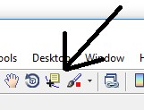

# Investigating the displacement time graph for a sprinting pupil.

#### The aim of this lesson is to give pupils the chance to investigate an accurate displacement / time graph generated by one of the students in the class.

# Curriculum links
### KS3 Physics National Curriculum
•	speed and the quantitative relationship between average speed, distance and time (speed = distance ÷ time) 

•	the representation of a journey on a distance-time graph

### KS4 Physics National Curriculum
•	interpreting quantitatively graphs of distance, time, and speed 
•	acceleration caused by forces; Newton’s First Law

# Planning
This activity requires the software package matlab.  Please ensure your pupils have access to this programme and the relevant scripts highlighted below.
It is advisable that teachers familiarise themselves with the process before delivering the lesson content to a class.

# Safety 
Hazzard	
* Playground surface

Risk	
* Pupil fall / injury

Control
* Assess surface conditions before the lesson
* Cancel if the ground is too slippery
* Ask pupil to take extra care when running

# Starter activity
The Physics of Sprinting worksheet
Data acquisition

* Making sure the Vertigo unit is fully charged, take the class to a suitable outdoor area to record your data.
* Turn the unit on and wait for the second LED to stop flashing.  This means that Vertigo has a GPS signal.  It may take a                    minute.
* Select a pupil to run with Vertigo.  
* Request that the pupil carries the device like an athlete carrying the
  Olympic torch.  (This is not strictly necessary but, with more wobbling around, 
  Vertigo may miss a GPS point.  This would make analysis far trickier
  – and is not conducive to good lesson outcomes.) 
  
  
*	Press the Log button (a solid LED light come on) and set the pupil off on a pre-determined route.

On their return, press Vertigo’s log button again.  The solid LED light starts to flash.  When it stops flashing, Vertigo may be turned off; the data is ready to be analysed.

# Data analysis

The following files should be emailed (or otherwise given to the pupils) before the lesson.  (Show my homework or similar may be of help here)
quatmultiply.m,  vtg_quat2eul.m,  quatconj.m,  load_up_your_data.m,  ll2utm.m getslopeintercept.m,  wbmf.m
These can all be found here:

Ask the pupils to open matlab and, using the top left icon, open the file “Load_up_your data”
In the meantime, the csv file created will need to be accessed by the pupils.  This should be added to a public drive or emailed to the pupils.

Pupils should execute this script by using the run button top centre of the screen.  They will be prompted to open a file.  This file should be the one recorded in your lesson.
After a short time, a graph similar to the one below, should appear:  

In the graphs above, it can be noted, that the pupil started to run at 3 seconds and stopped at about 28 seconds.

This information is important.

In the command window, located at the bottom of the screen, pupils will be asked, 
“What time do you wish to start analysis from?”
Pupils should enter a time in this window and hit the enter key.  For the example above, they might add 3, and press enter.
They will then be asked, 
“What time do you wish to end the analysis?”

28 would be a reasonable time to end.

The programme will then perform its analysis.  This may take a moment.

Eventually, you should see a graph similar to the one below:

 

On the ‘figure’ screen, under the desktop ‘tab’ is the data-cursor icon.

 

Pupils can click this to add a cursor point the graph’s curve.  This will give them ‘x and y’ coordinates.  In this case, Time and Displacement or Velocity.
Multiple cursor points can be added by holding shift and re-clicking.

The shape of the graphs can be discussed with the pupils.  They can then answer the following questions which can be found on the reverse of ‘The Physics of sprinting’.

What was X’s maximum speed?  
At what time did this occur?
Do you think Usain Bolt would have a similar shape graph to X’s?
What was X’s average speed?
Do these graphs match the graphs you drew earlier?  If there are differences, what are they?

Do you think you would be able to use this data to help improve X’s performance in the 100m sprint?

If so, how?

# Extension material

Go back to the file and to lines 399 to 411
These have been commented out but can revive them by click the green %x symbol at the top of the screen.  Some lines will remain green – this is intentional.
 

Running the script again will give the pupils a quiver plot of the pupil’s velocity through time.  See if the pupils can work out what they’re look at and ask them to label the axes.

This is an excellent time to initiate a discussion on vectors.

## Gradients
Closing the most recent quiver plot students should open the file:
 
Getslopeintercept.m

This will open the most recent figure and ask the user to click on the graph.  The pupils will be able to draw a tangent to the displacement/ time curve.
The programme will then generate a value for the gradient.
Using cursors as before, the pupils will be able to verify that the gradient of the distance time graph is the velocity at that instant.  (This is useful as it highlights the positive and negative gradients).
 

 
 
 
Finally, it is also possible, by de-commenting lines 386 – 390, to view the acceleration against/ time.
  

