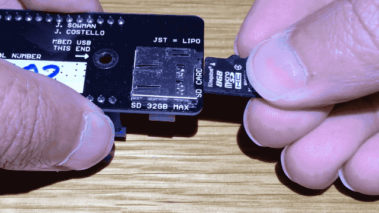
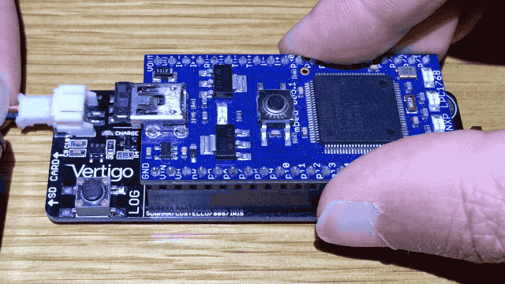
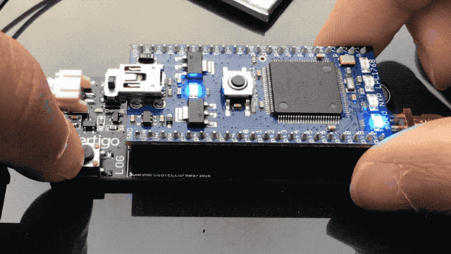
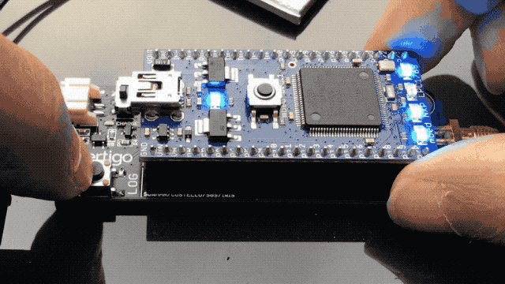
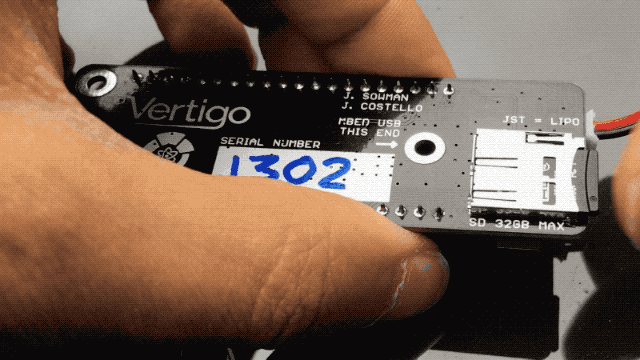
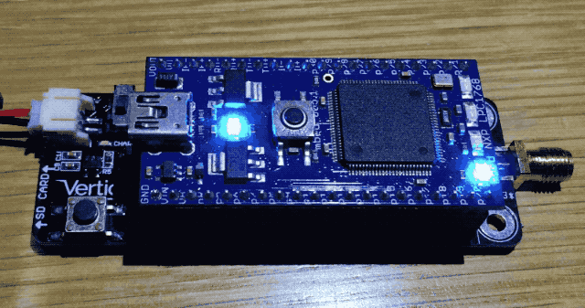

# Vertigo Instructions

Contents:

* [Setting up Vertigo](#building)
* [Using Vertigo](#usage)
* [Charging Vertigo](#charging)
* [Troubleshooting](#troubleshooting)

## Setting up Vertigo

When you receive Vertigo, your package should contain the following items:

1. SD to microSD adapter
2. microSD card
3. Battery
4. MBED processor
5. Vertigo sensor board

Putting everything together is really easy. Just follow these steps.

1. Locate the MBED processor on top of the Vertigo sensor board. **Ensure
correct orientation!** The MBED USB connector should be at the same end as the
battery connector, LOG button, and power switch on the Vertigo sensor board, as shown here:

    

2. Insert the microSD card by gently inserting it into the slot until it
clicks, then release.

    

3. Lastly, attach the battery connector. This is intentionally difficult to
insert to minimise the chance of accidental detachment. You won't need to
remove this again since Vertigo contains an onboard battery charger.

    

## Using Vertigo

Your constructed Vertigo looks like this:

    

### Powering-on Vertigo

1. Make sure the battery is connected and the microSD card inserted.
2. Slide the power switch towards the centre of the unit to power up.
3. The LEDs flash twice indicating battery level. 

    

    **Note:** The LEDs will flash twice indicating the battery level. If 4 LEDs
flash, the battery is fully charged. If only 1 or 2 flash, you should charge
your Vertigo soon.

4. LED1 begins to flash slowly indicating Vertigo has passed its self-test and
is ready. LED2 flashes fast whilst Vertigo is searching for a GPS lock.

If Vertigo does not boot, but instead shows the following LED sequence, the
battery is low. Please [charge Vertigo](#charging).

### Beginning Logging

When Vertigo is ready, press the LOG button to begin logging. Note that LED4
lights up solidly indicating that Vertigo is logging.

### Stopping Logging

During logging, press the LOG button again to stop. Note that LED4 will flash
fast whilst the data is written to the SD card, and will extinguish once
complete. Vertigo can now be powered off, or another logging cycle can begin.

### Remove SD card

The microSD card connector is a push-push connector. Gently push the card in to
release it, then remove it from the slot.

You can now insert the microSD card into the SD card adapter in order to
transfer the data to a computer for analysis.

## Charging Vertigo

Charging Vertigo is super easy since the battery charger is built in! You just
need a mini-USB cable, and follow these instructions to make sure your Vertigo
is fully charged.

1. Make sure Vertigo has its battery connected and is powered OFF.
2. Connect the mini-USB connector to the MBED USB port.
3. The green CHARGE LED will illuminate and a blinking pattern will be shown on
the blue LEDs.
4. When the green CHARGE LED is extinguished, the battery is charged.

If Vertigo's battery is too low to operate, upon power up, Vertigo will not
boot. Instead, it will show the low battery warning:

## Troubleshooting Vertigo

Vertigo flashes LED1 and LED4 alternately to indicate an error sequence, as
shown below. If this happens, make sure of the following:

* The SD card is formatted and inserted fully into the slot
* The Vertigo sensor board is in the correct orientation and fully seated

If you still have problems, please get in touch. Please include the contents of
the `vtg_info.txt` file that Vertigo creates on the microSD card. An example is
shown below:

    SERIAL=1303
    FIRMWARE=8576751
    MBED-LIBRARY-VERSION=134
    MBED-OS=5.3.3
