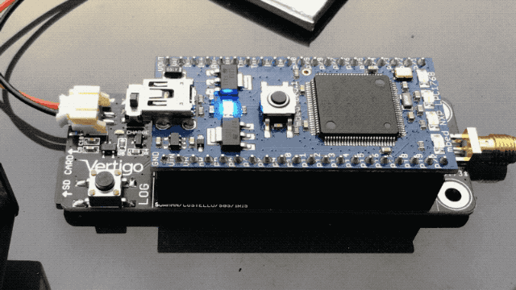

# Vertigo Instructions

Contents:

* [Setting up Vertigo](#building)
* [Using Vertigo](#usage)
* [Charging Vertigo](#charging)

## Setting up Vertigo

When you receive Vertigo, your package should contain the following items:

1. SD to microSD adapter
2. microSD card
3. Battery
4. MBED processor
5. Vertigo sensor board

## Using Vertigo

### Powering-on Vertigo

1. Make sure the battery is connected and the microSD card inserted.
2. Slide the power switch towards the centre of the unit to power up.
3. The LEDs flash twice indicating battery level. 

**Note:** The LEDs will flash twice indicating the battery level. If 4 LEDs
flash, the battery is fully charged. If only 1 or 2 flash, you should charge
your Vertigo soon.

4. LED1 begins to flash slowly indicating Vertigo has passed its self-test and
is ready. LED2 flashes fast whilst Vertigo is searching for a GPS lock.

## Charging Vertigo

Charging Vertigo is super easy since the battery charger is built in! You just
need a mini-USB cable, and follow these instructions to make sure your Vertigo
is fully charged.

1. Make sure Vertigo has its battery connected and is powered OFF.
2. Connect the mini-USB connector to the MBED USB port.
3. The green CHARGE LED will illuminate and a blinking pattern will be shown on
the blue LEDs.
4. When the green CHARGE LED is extinguished, the battery is charged.

