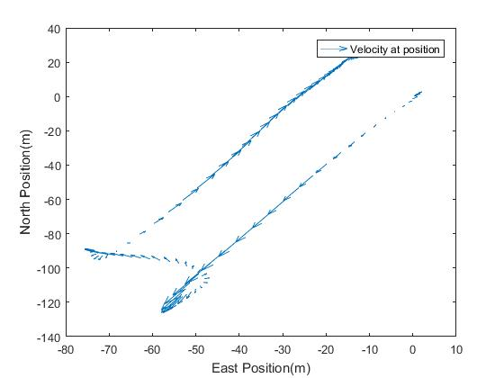

# October 2017

by [Jamie Costello](https://twitter.com/sgsphysics)

## Vertigo travels to Thorpe Park, Young Scientists Journal Conference and Southampton University

The Young Scientists Journal is the world's only peer-reviewed scientific journal for students.  With an enormous online readership, huge kudos is available if your work accepted by the editors.  It would be wonderful to see a Vertigo team can get an article published.

On October xx a small team of pupils presented their Vertigo work to date to delegates at the annual conference.  A daunting prospect, explaining some pretty tricky science to an audience of over two hundred at one of the most prestigious universities in the world.  Still, IRIS projects help students engage in science but also help develop the softer skills needed to be exceptional scientists and engineers of the future- communication is key.

To spice things up a little, the pupils rushed off to Thorpe Park and took some data on rides therein. 
Here are some results.
Some serious accelerations there.  Notice there are three sections on the rid giving the thrill seekers maximum 'g'.  Only one of these involves a change in speed.  Great school Physics here!

      |  
:-----------------------------------------------:|:----------------------------------:
 Velocity 'Quiver' plot on stealth               |  Maximum acceleration on Stealth

The team did brilliantly and came runner up in the poster competition.  Well done all.

                                 |  
:-----------------------------------------------:|:----------------------------------:
 Vertigo team present in Queen’s College|  Vertigo team with runner-up poster

# Wing Suit Flying

There’s plenty of anecdotal research that suggests that pupils like the idea of going into engineering to improve quality of life.  And why not.  After all, what a wonderful feeling to know your work has helped others.  Sometimes that work might even go into life-saving.  It seems Vertigo might have that opportunity.

Wing Suit flying is an incredibly dangerous activity.  Clearly, it is very enjoyable too.  Some quite exceptional people have died whilst pushing forwards the limits of their sport and some of these people had been friends of Angelo’s.  
The problem appears to be that the wing suits stall – (their performance dramatically deteriorates as the flier’s angle of attack get to be too high).  Angelo explained all to the pupils and furnished them with some data and understanding which will be of enormous help to them in the coming weeks.

                                 

Vertigo is able to measure this angle of attack.  It’s not completely straight forward and pupils will need to brush up on their vector calculus- the dot product has a use beyond our maths text books!

Flying at the international wing suit championships in America- Vertigo will have data from Angelo soon.  Watch this space.
[Good Luck Angelo](https://www.skydivefyrositylasvegas.com/profile/angelo-grubisic-great-britain/) 

## last bit of news for now

# September 2017

 

## The new academic year begins.
 

Working tirelessly over the summer [JonSowman](https://twitter.com/jonsowman) has produce twelve awesome Vertigos.  One for him, ten for schools and one for me.  Overcoming a slight [mishap](http://www.getsurrey.co.uk/news/surrey-news/spook-hill-north-holmwood-closed-13666823) at his local post office, the units are ready to ship out to our excited schools.

 
 
 
 
 
 

 
 
 
 
 
 
 
At present, three schools, beyond the Sutton IRIS hub, have started the journey to Vertigo data analysis.  This involves installing matlab and reviewing a few test files.  Not a completely trivial exercise.  So, taking Jon’s lead, I developed a [webpage](https://sgsvertigo.github.io/vertigo-instructions/VertigoIMU_Data_analysis_with_Matlab.html) to lead schools through, step by step, the nuances of matlab’s graph plotting functions.
Results from our own preliminary experiments have been very encouraging.  Vertigo continues to amaze all those who have seen it in action.  

The webpage has proved successful with other schools and they are now ready to take their own data files.
In particular, Cokethorpe school have strong links with the RAF at Brize Norton.  Could they get a Vertigo on an RAF plane?

 

      |  
:-------------------------:|:-------------------------:
 Vertigo on a jet?         |  Dr Grubisic

Here, we are eagerly waiting for data files to come through from Dr Angelo Grubisic of Southampton University and the Icarus project.  Angelo, took a vertigo out on one of his wing-suit flights and is keen for pupils to delve into this data for one key variable.  More on this in next month’s instalment.

We also have pupils heading off to Thorpe Park for a second round of data acquisition.  The Colossus looks to be the ride of choice for data taking.  Results will be published for the first time at the [Young Scientists Journal conference](https://events.ysjournal.com/) in Oxford on 12TH October.

 

         |  
:-------------------------:|:-------------------------:
 Colossus Thorpe park     |  Rowers improve the 'catch'.

Promising links have also been developed with St Anne’s at Oxford where their rowing team are interested in a school looking into some data for them- any advantage over the competition.

Other sporting suggestions continue to roll in.  One person recently suggested we contact British pair, Penny Coomes and Nick Bucklan, who, just last week, won their place at the Winter Olympics in South Korea 2018 .  Vertigo on the leg of a skater completing a triple salchow would be quite something. I am looking for schools to Volunteer.

