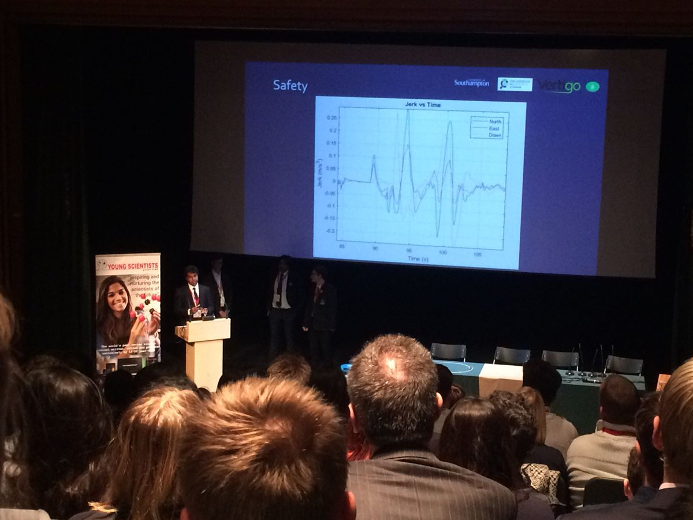

# November 2017

by [Jamie Costello](https://twitter.com/sgsphysics)                                                                                                
[Home](index.md)

## Pitches, Rolls, Yawns.

There has been a slight bottle neck in delivering vertigos to schools.  At present, analysis requires matlab and getting this to teachers and pupils has been harder than expected. 
Mathworks have been very helpful and offered a free licence for a standalone machine to accompany each Vertigo.  This will give an invaluable start to those schools looking forward to analysing results of their own.  The laptop/ vertigo packages are being prepared as I type.

Therefore, this month then I will focus on one of IRIS’ less obvious goals – “To Enrich teachers’ careers”.

I have been teaching Physics for 20 years.  In that time, I have become very familiar with the A-level specification and the kind of questions bright, enthusiastic pupils might ask.  I am keenly aware of the sticking points they have in moving from a point of 'cognitive confusion' to understanding, but I had completely forgotten what it felt like.  I’ve relearnt it.  And what’s more, I found it far more enjoyable than I ever did when I was younger.

My journey this last month has taken me on a tour of quaternions and rotating frames of reference.  Vertigo was not kicking out the data we needed but everyone in the team knew it was hidden on the SD card somewhere.  That data mining and analysis was difficult but it was also fun.  And, when I finally found the solution, deeply rewarding.  

So now I know a little more about quaternions, Euler angles, intrinsic and extrinsic rotations.  All of which will add very little to my day-to-day job.  Except that, through this learning I have reconnected with the feeling of learning itself.  I now have far more empathy with my students having positioned myself on the opposite side of the classroom, and I think it’ll make me a better teacher.

                    |  
:-----------------------------------------------:|:----------------------------------:
 Me explaining a rotating and world frame at IRIS symposium.              | Vertigo on a record player

It has also opened a myriad of questions for me, the proverbial can of worms.  The most troubling, “why did I enjoy getting stuck and finding the work hard whilst some of my pupils don’t”.  A few seem far happier when they- ‘just get it’.
I have a hypotheses or two but I suspect there’s more to learn here.  

Suffice to say that with the expansion of the internet since I was at university the opportunity for self-guided learning is immense.  Sites such as you tube, the khan academy, Wikipedia and Hyperphysics give huge scope for knowledge acquisition.  There are many less well know pages too, here’s award winning academic [Jess Wade’s site](https://makingphysicsfun.com/)- there’s enough here to keep a person busy for weeks!  

So, I was I wrapping my learning around everyday life.  Something had to give way and that thing was sleep.  I didn’t have much free time during daylight hours and so I ate into a little bit of the night instead.  As a long-term strategy, I suspect this would end in catastrophe but as a one off it was great fun.
Some results

Here’s me walking down my road whilst also rotating around a vertical axis (That is a yaw in an extrinsic frame!).  The position plot is trivial.  But what I have also added is my velocity vector and my Yaw angle.  The second graph shows what could be described as my ‘angle of attack’.  The angle between my velocity and the direction I am facing.  I should add, I can now use matlab…

          |   
:-----------------------------------------------:|:----------------------------------:
  Position, Velocity and Yaw   | Vertigo on a record player

The angle of attack is important to planes and flying- that’s why it is important here.  Angelo had a few problems gathering data but we’re still hopeful something can be gathered.  Before then, I have started ‘flight club’ at school.  I’ll be welcoming students from St Philomena’s, Wallington Girls as well as from my own school.  As with all my classes- first rule- learning is fun.

# October 2017

by [Jamie Costello](https://twitter.com/sgsphysics)                                                                                                
[Home](index.md)

## Vertigo travels to Thorpe Park, Young Scientists Journal Conference and Southampton University

The [Young Scientists Journal](https://ysjournal.com/) is the world's only peer-reviewed scientific journal for students.  With an enormous online readership, huge kudos is available if your work is accepted by the editors.  It would be wonderful to see a Vertigo team have an article published.

  

On October 12th a small cohort of pupils presented their Vertigo work to delegates at the annual conference.  A daunting prospect, explaining some pretty tricky science to an audience of over two hundred, at one of the most prestigious universities in the world.  Still, IRIS projects help students engage in science but also help develop the softer skills needed to be the exceptional scientists and engineers of the future- communication is key.

To spice things up a little, the pupils rushed off to Thorpe Park the weekend before and took some data on rides therein. 
Here are some results.

      |  
:-----------------------------------------------:|:----------------------------------:
 Velocity 'Quiver' plot on Stealth               |  Maximum acceleration on Stealth

Impressive accelerations.  Notice, there are three sections on the ride giving thrill seekers maximum 'g'.  Yet, only one of these involves a change in speed.  Some great school Physics for sure.  No doubt a year 10 class would love to learn the correct definition of acceleration at a theme park! 

The team did brilliantly winning runner up in the poster competition.  Well done all.

                                 |  
:-----------------------------------------------:|:----------------------------------:
 Vertigo team present in Queen’s College|  Vertigo team with runner-up poster

## Wing Suit Flying

There’s plenty of anecdotal research that suggests that pupils like the idea of going into engineering as a career to improve the quality of peoples' lives.  And why not?  After all, what a wonderful feeling to know your work has helped others.  Sometimes that work might even go into life-saving and it seems Vertigo might have that opportunity.

Wing Suit flying is an incredibly dangerous activity.  Clearly, it is very enjoyable too.  Sadly, some quite exceptional people have died whilst pushing forward the limits of their sport and some of these people had been friends of Angelo Grubisic's.  
The problem appears to be that wing suits stall – (their performance dramatically deteriorates as the flier’s 'angle of attack' gets to be too high).  Angelo explained all to the pupils and furnished them with some data and understanding which will be of enormous help to them in the coming weeks.

                                 

Vertigo is able to measure this angle of attack.  It’s not completely straight forward and pupils will need to brush up on their vector calculus (- the dot product has a use beyond our maths textbooks!) but it's very achievable given a little dedication.  Fingers crossed we can add something.

Flying at the international wing suit championships in America- Vertigo will have data from Angelo soon.  Watch this space.
[Good Luck Angelo](https://www.skydivefyrositylasvegas.com/profile/angelo-grubisic-great-britain/) 

# September 2017

 

## The new academic year begins.
 

Working tirelessly over the summer [JonSowman](https://twitter.com/jonsowman) has produce twelve awesome Vertigos.  One for him, ten for schools and one for me.  Overcoming a slight [mishap](http://www.getsurrey.co.uk/news/surrey-news/spook-hill-north-holmwood-closed-13666823) at his local post office, the units are ready to ship out to our excited schools.

 
 
 
 
 
 

 
 
 
 
 
 
 
At present, three schools, beyond the Sutton IRIS hub, have started the journey to Vertigo data analysis.  This involves installing matlab and reviewing a few test files.  Not a completely trivial exercise.  So, taking Jon’s lead, I developed a [webpage](https://sgsvertigo.github.io/vertigo-instructions/VertigoIMU_Data_analysis_with_Matlab.html) to lead schools through, step by step, the nuances of matlab’s graph plotting functions.
Results from our own preliminary experiments have been very encouraging.  Vertigo continues to amaze all those who have seen it in action.  

The webpage has proved successful with other schools and they are now ready to take their own data files.
In particular, Cokethorpe school have strong links with the RAF at Brize Norton.  Could they get a Vertigo on an RAF plane?

 

      |  
:-------------------------:|:-------------------------:
 Vertigo on a jet?         |  Dr Grubisic

Here, we are eagerly waiting for data files to come through from Dr Angelo Grubisic of Southampton University and the Icarus project.  Angelo, took a vertigo out on one of his wing-suit flights and is keen for pupils to delve into this data for one key variable.  More on this in next month’s instalment.

We also have pupils heading off to Thorpe Park for a second round of data acquisition.  The Colossus looks to be the ride of choice for data taking.  Results will be published for the first time at the [Young Scientists Journal conference](https://events.ysjournal.com/) in Oxford on 12TH October.

 

         |  
:-------------------------:|:-------------------------:
 Colossus Thorpe park     |  Rowers improve the 'catch'.

Promising links have also been developed with Oriel College at Oxford where their rowing team may be interested in a school looking into some data for them- any advantage over the competition.

Other sporting suggestions continue to roll in.  One person recently suggested we contact British pair, Penny Coomes and Nick Bucklan, who, just last week, won their place at the Winter Olympics in South Korea 2018 .  Vertigo on the leg of a skater completing a triple salchow would be quite something. I am looking for schools to Volunteer.

